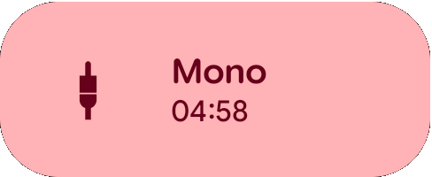

# Android-Audio-Channel-QS-Tile

Android app which adds a Quick Settings Tile to control the “Audio Channel” option (Mono/Stereo) in Accessibility Settings -> Audio Adjustment.

This is a fork of [VarunS2002/Android-Audio-Channel-QS-Tile](https://github.com/VarunS2002/Android-Audio-Channel-QS-Tile) that puts Mono on a timer, working just like LineageOS's Caffeine tile: Mono automatically switches back to Stereo when the timer runs out.

 

## Features

- Tapping the tile enables Mono and starts a countdown, shown live on the tile
- Tapping again within 5 seconds cycles the duration: **1 min → 5 min → 10 min → ∞ → off**
- Tapping after 5 seconds simply toggles Mono off
- **Long-pressing** the tile jumps straight to **∞** (no timer)
- When the timer expires, Mono reliably reverts to Stereo — even if the app's process was killed in the background
- After a reboot, Mono reverts to Stereo (timers don't survive reboots)
- Tile is highlighted while Mono is on and dimmed when in Stereo

| Gesture | Effect |
|---|---|
| Tap (from off) | Mono, 1:00 countdown |
| Tap again within 5s | Cycle: 5:00 → 10:00 → ∞ → off |
| Tap after 5s | Toggle off |
| Long-press | Straight to ∞ |

## Downloads

Each release ships two APKs — pick one:

| Build | Who it's for | Trade-off |
|---|---|---|
| **Standard** (`…_x.y.z.apk`) | Any device, no root needed | Targets SDK 22 (required for the settings write — see Notes), so Android 14+ needs the special install method below and Play Protect warns about the old target |
| **Shizuku/Root** (`…_x.y.z_shizuku-root.apk`) | Devices with [Shizuku](https://shizuku.rikka.app/) or root | Targets the current SDK: installs normally on any Android version, no warnings. Prefers Shizuku when it's running, falls back to root (Magisk prompts on the first toggle) |

Grab the APK from the [Releases](https://github.com/ethanm6/Android-Audio-Channel-QS-Tile/releases/) page, or add this repo to Obtainium to get updates automatically (under *APK filter*, use `shizuku-root` to track the Shizuku/Root build, or exclude it with `^((?!shizuku-root).)*$` for the standard one):

> [!IMPORTANT]
> On **Android 14+** the normal package installer refuses the **standard** APK (it targets SDK < 23), so tapping it won't work. Install via adb (`adb install --bypass-low-target-sdk-block <apk>`), or use **Obtainium with the Shizuku or root install method**, which applies the bypass automatically. Android 7–13 installs normally. The **Shizuku/Root** APK is unaffected and installs normally everywhere.

## Setup

1. Install the APK
2. Add the tile: pull down Quick Settings → edit tiles → drag in **Audio Channel**
3. Tap the tile once and grant access: the standard build asks for the *Modify system settings* permission; the Shizuku/Root build asks via Shizuku (if running) or Magisk

## Requirements

- Android 7.0+ (Nougat/SDK 24)

## Notes

- Regarding **Play Protect** / *"built for an older version of Android"* warnings (standard build only):
  - These appear because the standard build targets Android 5.1 (Lollipop/SDK 22).
  - This is intentional: apps targeting Android 6 (Marshmallow/SDK 23) and above are not allowed to modify secure system settings such as "Audio Channel" — not even with special permissions granted.
  - The Shizuku/Root build sidesteps this by performing the write as the shell user (Shizuku) or root, so it targets the current SDK and produces no warnings.
  - The app is safe to install and use, and no data is collected.

- Long-pressing the tile closes the notification shade — this is enforced by Android (long-press launches an activity) and cannot be avoided.

- This app may not work on all devices due to ROM specific issues.

- If you face any issue or have a suggestion then feel free to open an issue.

## Support

If you find this fork useful, you can support me on Ko-fi:

